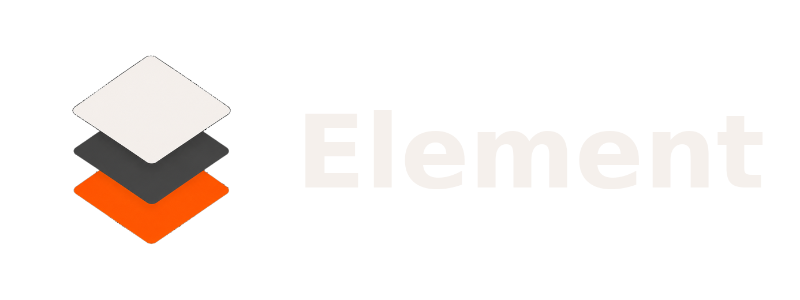

<p align="center">
  <picture>
    <source media="(prefers-color-scheme: dark)" srcset="brandkit/wordmark/wordmark-horizontal-light-purple.png">
    <source media="(prefers-color-scheme: light)" srcset="brandkit/wordmark/wordmark-horizontal-dark.png">
    
  </picture>
</p>


<p align="center">
  <strong>Floating command palette · Module system · Global hotkey</strong><br>
  <em>for Windows — built natively in Rust with iced.</em>
</p>

<p align="center">
  
  
  
</p>

---

Element is a global hotkey-activated floating launcher. Press **Alt+Space** to summon a command palette anywhere, type `/` to browse modules (calculator, emoji picker, notes), and press Enter to execute. It runs as a background daemon — zero UI until you need it.

## Features

- **Global hotkey** — Toggle the overlay with `Alt+Space` (configurable). Uses `global-hotkey` crate for proper OS-level registration; falls back to polling if the hotkey is already taken.
- **Debounced search** — Module results appear 150ms after you stop typing (configurable via `config.json`).
- **Slash-command modules** — Type `/` to see available modules. Built-in:
  - `/calc` — Evaluate arithmetic expressions
  - `/emoji` — Search and copy emojis
  - `/savenote` — Save a note
  - `/listnotes` — Browse saved notes
  - `/searchnotes` — Full-text search notes
  - `/getnote` — Read a note by ID
  - `/help` — Display available commands
- **Always-on-top overlay** — Transparent window, centered on screen, rounded corners, no decorations.
- **Resident daemon** — Uses `iced::daemon()`. Background process with zero windows at boot; window opens/closes on each hotkey press (no hide/show).
- **Minimum dependencies** — No JavaScript, no browser, no Electron.

## Architecture

```
src/
├── main.rs         # iced daemon entry point, subscription setup
├── app.rs          # State, update, view, hotkey management, debounce
├── module.rs       # Module trait + registry, built-in modules
├── style.rs        # Colors, button/container styles
├── config.rs       # JSON config (hotkey, dimensions, debounce)
├── database.rs     # SQLite-backed note storage
└── clipboard.rs    # Clipboard monitor (unused currently)
```

### Hotkey system

Two layers, tried in order:

1. **`global-hotkey` crate** — calls `RegisterHotKey` (Windows) or the OS equivalent. Clean, responsive, preferred path.
2. **Polling fallback** — if registration fails (e.g., another app already owns the combination), falls back to `GetAsyncKeyState` on a background thread with an mpsc channel.

### Module trait

```rust
trait Module {
    fn command(&self) -> &str;
    fn name(&self) -> &str;
    fn search(&self, query: &str) -> Vec<(String, String, String)>;
    fn activate(&self, input: &str) -> Option<String>;
}
```

Modules register themselves with `ModuleRegistry` at boot. The palette discovers them dynamically.

## Installation

```bash
git clone https://github.com/vaibhxvvy/element.git
cd element
cargo run --release
```

The binary runs silently in the background. Press your hotkey to summon the overlay.

### Requirements

- Rust 1.77 or newer
- Windows (the app is Windows-only; other platforms are stubs)

## Configuration

Config is stored at `%USERPROFILE%\.element\config.json` and auto-created on first run:

```json
{
  "hotkey": "Alt+Space",
  "window_width": 580,
  "window_height": 420,
  "debounce_delay_ms": 150
}
```

Hotkey format: modifier keys joined by `+`. Supported: `Alt`, `Ctrl`/`Control`, `Shift`, `Win`/`Super`/`Cmd`/`Meta` and a final key (`Space`, etc.).

## Usage

| Action | Input |
|--------|-------|
| Toggle overlay | `Alt+Space` (or your configured hotkey) |
| Browse modules | Type `/` |
| Select result | Click or arrow keys + Enter |
| Close overlay | `Escape` |

## Build from source

```bash
cargo build --release
./target/release/element
```

## License

MIT
