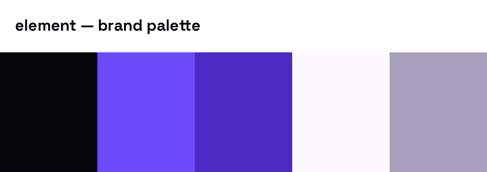

<p align="center">
  <picture>
    <source media="(prefers-color-scheme: dark)" srcset="brandkit/wordmark/wordmark-horizontal-light-purple.png">
    <source media="(prefers-color-scheme: light)" srcset="brandkit/wordmark/wordmark-horizontal-dark.png">
    
  </picture>
</p>

<p align="center">
  
</p>

<p align="center">
  <strong>Rust-cast-style launcher · Notepad · Mind map · Local search</strong><br>
  <em>for Windows and Linux — built natively in Rust.</em>
</p>

<p align="center">
  
  
  
  
</p>

---

Element is a single, fast Rust binary that replaces the scattered tools you reach for every day. It starts as a native text editor — and grows into a global command palette, a note graph, and a search engine for your own files.

Think Raycast or Alfred, but native to Windows and Linux, with a built-in second-brain layer.

## Currently shipped (Phase 0)

The foundation is a native GUI text editor — fast, distraction-free, and ready for real work.

- **Native GUI** — Built with [GPUI](https://github.com/zed-industries/zed/tree/main/crates/gpui), Zed's GPU-accelerated UI framework. Looks and feels first-class on every platform.
- **Fast startup** — Launches instantly. No splash screens, no waiting.
- **Word wrap** — Toggle on/off from the View menu.
- **Find & Search** — Quick find bar with match counting and next-match navigation.
- **File operations** — Open, Save, Save As with native file dialogs.
- **Unsaved changes protection** — Never lose your work; prompted to save before closing.
- **Dark & Light modes** — Respects your system theme automatically.
- **Custom icon** — Ships with a full brand kit, from window icon to Linux hicolor theme and Windows tile assets.
- **Keyboard shortcuts** — Every action has a shortcut (`Ctrl+S`, `Ctrl+O`, `Ctrl+F`, etc.).

## Roadmap

| Phase | Feature | Status |
|-------|---------|--------|
| 0 | Text editor — native, distraction-free buffer | ✅ Shipped |
| 1 | **GPUI port + launcher overlay** — egui → GPUI rewrite, global hotkey, floating command palette with slash-command module system | 🚧 Building |
| 2 | **Markdown renderer + note graph** — live `.md` preview, linked notes with backlinks | 🔮 Planned |
| 3 | **Mind map node-graph** — visual idea linking backed by file data | 🔮 Planned |
| 4 | **Local search index (SQLite)** — background-indexed search across files, notes, graphs | 🔮 Planned |

Every future feature is designed to be triggerable from the command palette and indexed by the local search layer. Nothing is a dead-end standalone screen.

## Architecture

```
src/
├── main.rs         # GPUI entry point
├── app.rs          # App shell, module registry, view coordination
├── module.rs       # Module trait + HashMap registry (no if/else chains)
├── overlay.rs      # Floating command palette (global hotkey → popup)
├── config.rs       # Theme, settings, serde persistence
└── editor/
    ├── buffer.rs   # Text buffer — open, save, cursor, undo
    ├── view.rs     # GPUI Render impl for the editor
    └── find.rs     # Find/replace logic
```

### Module system

Any built-in tool (editor, notes, timer, mindmap) registers itself with the `ModuleRegistry` via a shared trait. The command palette discovers modules dynamically — no hardcoded if/else chains.

```rust
trait Module {
    fn command(&self) -> &str;       // "/notes"
    fn name(&self) -> &str;          // "Notes"
    fn activate(&mut self, cx: &mut WindowContext);
}
```

## Installation

```bash
git clone https://github.com/vaibhxvvy/element.git
cd element
cargo run -- path/to/file.txt
```

To build a release binary:

```bash
cargo build --release
./target/release/element
```

### Requirements

- Rust 1.77 or newer
- A GPU that supports WebGPU (modern integrated or discrete GPU)

## Usage

```bash
element                  # Start with a blank buffer
element notes.txt        # Open an existing file
cargo run --release      # Run the release build
```

### Keyboard shortcuts

| Shortcut | Action |
|----------|--------|
| `Ctrl+N` | New file |
| `Ctrl+O` | Open file |
| `Ctrl+S` | Save |
| `Ctrl+Shift+S` | Save As |
| `Ctrl+F` | Toggle find bar |
| `F3` | Find next match |
| `Ctrl+D` | Insert current date & time |
| `Ctrl+Q` | Quit |
| `Ctrl+A` | Select all |

## Philosophy

Element is built on three principles:

1. **Speed over features.** It should open instantly and respond instantly. Every millisecond of startup and every frame of latency matters.
2. **Simplicity over configuration.** No plugins, no language servers, no settings files. What you see is what you get.
3. **Quality over quantity.** A small set of well-crafted features beats a thousand half-baked ones.

## Brand

Element has a full brand identity at [`brandkit/`](brandkit/README.md):

- **Color palette:** `#6D4AFA` primary, `#08060D` ink, `#FDFAFE` core white
- **Wordmarks:** Horizontal lockups for dark and light backgrounds
- **App icons:** 16→1024px PNGs, Windows `.ico`
- **Linux integration:** hicolor icon theme + `.desktop` file
- **Social:** GitHub preview, OG banner, Twitter/X header
- **Favicon:** Full web set with `site.webmanifest`

## License

MIT
